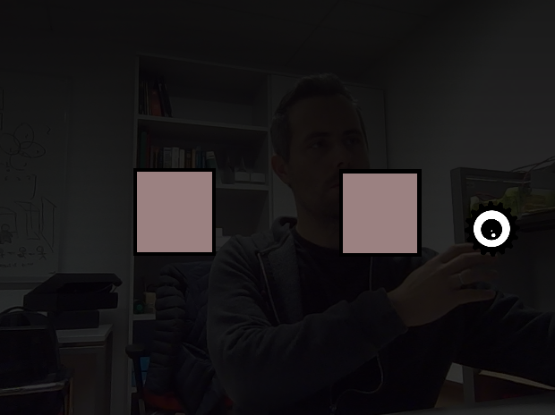

Bouncy - Godot OpenCV integration example
=========================================

An example of using OpenCV (version 4+) in your Godot game through GDNative API. It works with Godot 3.1+, the example allows you to control a ball initialized using face detection using optical flow in the camera (e.g. by waving hand).

Setup
-----

You must have OpenCV installed and discoverable. Then, compile the native code in the `native` directory, this will produce library `bouncy`, which you have to copy to the `native` folder and, if needed, fix the path to it in `bouncy.gdnlib` file. Then you can open the project in Godot.

